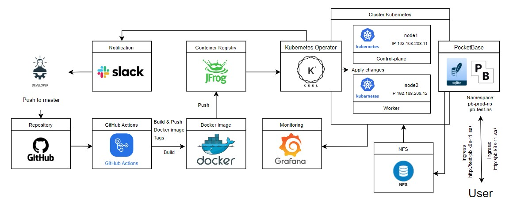

# Project report.

### **Project's reporter:** Shvedov Vitaliy
### **Group number:** md-sa2-28-23

### Description of application for deployment:

1.  **Name of application:** Web site on the base of PocketBase single binary framework.
    - PocketBase (https://pocketbase.io/):
        - embedded SQLite.
        - embedded web server.
        - DB administartion dashboard.
2.  **Data Base:**  Embedded database (SQLite).
3.  **Git repository:**  [->Project<-](https://github.com/Patsa-Vatsa/Project_it-academy).

### Pipeline. High Level Design:

### Technologies which were used in project:

- Git - version control system (https://git-scm.com/)
- Kubernetes - runtime environment (https://kubernetes.io/)
- Helm - package installer (https://helm.sh/)
- Ingress-Nginx Controller (https://kubernetes.github.io/ingress-nginx/)
- Keel - k8s Operator (https://keel.sh/)
- k9s - inspect and monitoring tool (https://k9scli.io/)
- GitHub Actions (https://github.com/features/actions)
- JFrog - artifacts repository (https://jfrog.com/)

Orchestration & Automation:

- Git
- GitHub Actions
  - https://github.com/mr-smithers-excellent/docker-build-push/
- Keel k8s Operator

### CI description: 

- application building and packaging made via GitHub Actions (.github/workflows/pipeline.yaml)
- triggered by every push action on to any branch or tag
  - checking out code
  - building image from app/Dockerfile
  - tagging image
    - :main-SHA for any regular commit to main branch
    - :latest for any push event
    - :v1.2.3 for a corresponding git revision tag (SemVer)
    - :prod for rewritable tag
  - pushing built image to JFrog artifacts registry

### Deployment flows short description:

- there are 2 environments
  - "latest" - aka test environment
  - "production"
  - see ops/deploy-prod.yaml and ops/deploy-latest.yaml
- Keel k8s operator automatically tracks updates of tagged Docker images inside JFrog artifacts repository
  - via Polling method
  - for "latest" env it watches for :latest tag
  - for "production" - :prod
- it is possible to enable "approve deployment" workflow either via Keel's Admin dashboard or Slack notiifications

How does new/upgrade deployment work
- every git push origin main will update "latest" environment
- making release to "production":
  - git tag v1.2.3 tags git revision as well as Docker image
  - git push origin v1.2.3 starts the pipeline
  - git tag prod v1.2.3 --force rewrites current release pointer
  - git push origin prod --force redeploys to production

### Rollback flow description and implementation:

- prod is a moving git tag - it is intended to overwrite it in public GitHub repository
- Keel Operator looks for any changes in Docker image tagged like :prod
- Reverting to previous/another revision is simple as git tag prod v1.2.2 --force && git push origin prod --force

### Links: [->Click here<-](https://github.com/Patsa-Vatsa/Project_it-academy)

### Changelog
- feature v1.0.4
- feature v1.0.5
- feature v1.0.6